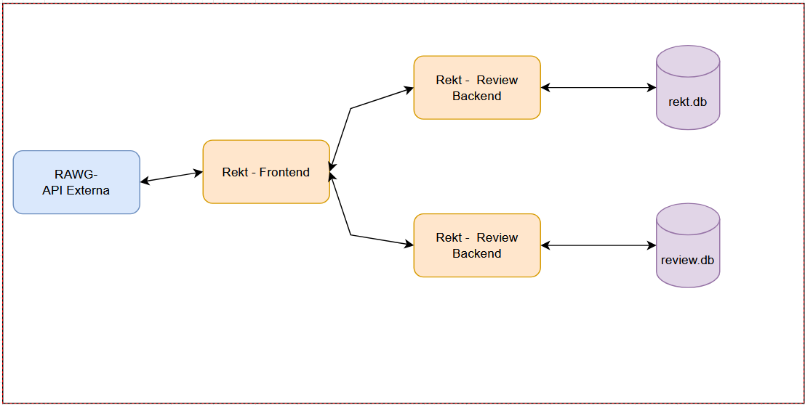

# REKT - Game Backlog

## Descrição

O **REKT - Game Backlog** é uma aplicação para gerenciar o backlog de jogos de um usuário, permitindo adicionar, listar, editar e excluir jogos. Utilizamos uma segunda API para fazer reviews em jogos e usamos uma API externa para trazer dados dos jogos. A aplicação utiliza APIs para se comunicar com o backend, armazenando os dados em um banco de dados SQLite.

## Como Instalar

### 1. Clonando o Repositório

Primeiro, clone o repositório para sua máquina local:

```bash
git clone https://github.com/extrasza/rekt-frontend.git
cd rekt-frontend
```
```bash
Alterar as api keys no arquivo config.js
```

### 2. Requisitos

- [Docker](https://www.docker.com/)
- [RAWG Api Key](https://rawg.io/apidocs)

### 3. Utilizando Containers
```bash
docker build -t rekt-frontend .
docker run -p 8080:80 rekt-frontend
```
Este comando faz com que a aplicação esteja disponível no navegador, acessível pelo endereço http://localhost:8080/

### 4. Fluxograma


